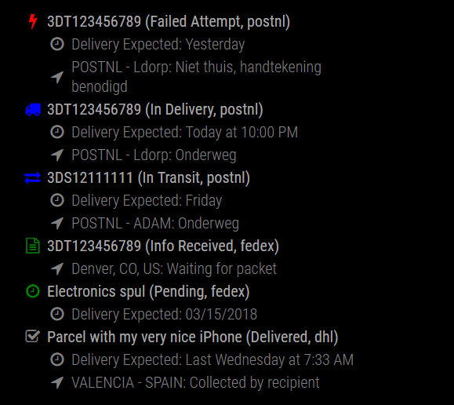
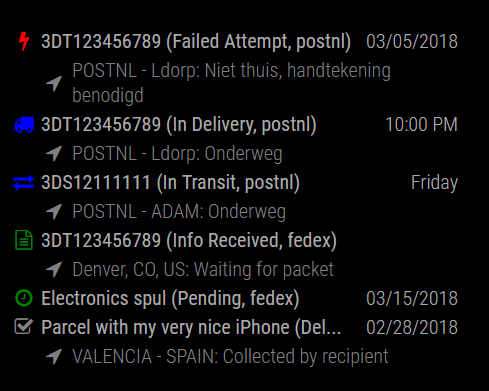
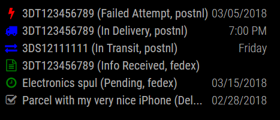
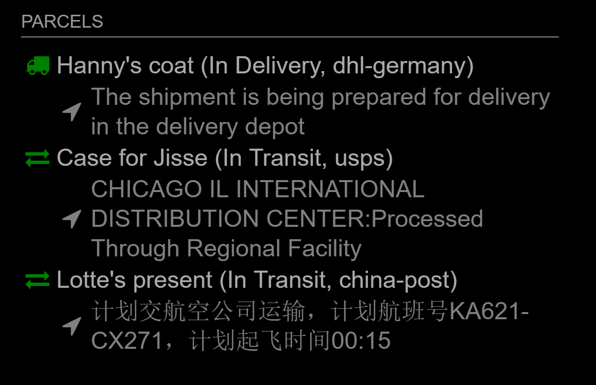
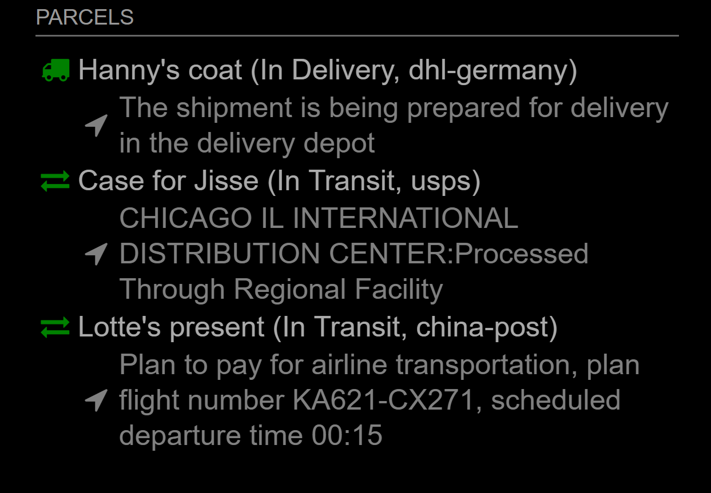
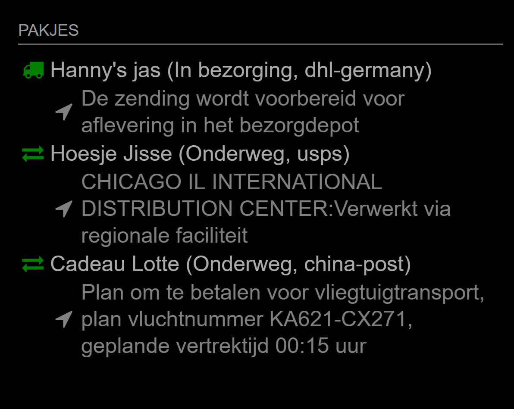

## MMM-Parcel

Track deliveries . Supports 428 couriers worldwide based on aftership.com

## Here's what you get

View parcel tracking status, for display on Magic Mirror.
Inspired by MMM-AfterShip by Mykle1.

## Examples

Example with expected deliveries on a separate line. Expected delivery line is only shown when an ETA is known. 



Example of the same in the compact view:



And in the very compact view (one-liner per shipment):



## Installation

* Go into the `~/MagicMirror/modules` directory and do `git clone https://github.com/martinkooij/MMM-Parcel`.

* Go into the MMM-Parcel directory and do `npm install`

* Get an account on aftership.com (Free account is OK if you track less than 100 parcels per month)

* Get your FREE API Key from https://www.aftership.com/ via settings -> API. 

* You MUST add couriers to your account at aftership.com. 

* Add your own trackings

* Tell me what you like, or any issues you have. It is difficult to test as I cannot control or test all variations from AfterShip. 

## Updates
Do a `git pull` in the MMM-Parcel module directory. Running a `npm install` again in the same directory is recommended and does no harm. 
In case supporting features need new packages, such as when you upgrade to a version 
with the automatic translations feature, the `npm install` is really needed.  

## Using the module

To use this module, add it to the modules array in the `config/config.js` file:
````javascript
{
module: 'MMM-Parcel',
position: 'top_right',	// This can be any of the regions. Best results in left or right regions.
header: 'My Parcels',   // This is optional
config: {
	apiKey: 'Your API KEY goes here', // Your free API Key from aftership.com
	maxNumber: 10, //maximum number of Parcels to show
	showCourier: true,
	autoHide: false, // hide module on mirror when there are no deliveries to be shown
	isSorted: true,  // sort on delivery Status (most important ones first)
	compactness: -1, // 0 = elaborate, 1 = compact display, 2 = very compact, one-liner per shipment, -1 = automatic
	hideExpired: true, // don't show expired parcels
	hideDelivered: false, // determines whether to show delivered parcels. Not recommended to hide. 
	updateInterval: 600000, // 10 minutes = 10 * 60 * 1000 milliseconds. 
	parcelStatusText: ["Exception", "Failed Attempt","In Delivery", "In Transit", 
	                   "Info Received", "Pending", "Delivered", "Expired"], // This is the default. Enter your own language text
	parcelIconColor: ["red", "red", "green", "green", "cornflowerblue", "cornflowerblue", "grey", "grey"], // This is the default. Change for other icon colors
	onlyDaysFormat: {
	  lastDay : '[Yesterday]',
	  sameDay : '[Today]',
	  nextDay : '[Tomorrow]',
	  lastWeek : '[Last] dddd',
	  nextWeek : 'dddd',
	  sameElse : 'L'
	  }, // formatting when only days are shown and time is unknown. 
	expectedDeliveryText: 'Delivery Expected: ',	 // This is the default. Changes time infoline. 
    noParcelText: 'No Shipment Data'	 // This is the default. Changes infoline in case of no trackings. 
	}
},
````

The above example is a bit long. If you are OK with English texts and you do like the default colors and settings 
provided by the module the following simple config suffices!

````javascript
{
module: 'MMM-Parcel',
position: 'top_right',	// This can be any of the regions. Best results in left or right regions.
header: 'My Parcels',   // This is optional
config: {
	apiKey: 'Your API KEY goes here' // Your free API Key from aftership.com
	}
},
````

## Configuration options

The following properties can be configured:


<table width="100%">
	<!-- why, markdown... -->
	<thead>
		<tr>
			<th>Option</th>
			<th width="100%">Description</th>
		</tr>
	<thead>
	<tbody>
		<tr>
			<td><code>apiKey</code></td>
			<td>REQUIRED: Your AfterShip API access token, you can get it via <a href="https://aftership.com">aftership.com</a>. This is the only required config field<br>
				<br><b>Possible values:</b> <code>string</code>
				<br><b>Default value:</b> <code>none</code>
			</td>
		</tr>
		<tr>
			<td><code>maxNumber</code></td>
			<td>Maximum number of parcels that are shown<br>
				<br><b>Possible values:</b> <code>int</code>
				<br><b>Default value:</b> <code>10</code>
			</td>
		</tr>
		</tr>
		<tr>
			<td><code>showCourier</code></td>
			<td> Determines whether  the shortcode of the courier in the Parcel header is shown<br>
				<br><b>Possible values:</b> <code>true</code>, <code>false</code>
				<br><b>Default value:</b> <code>true</code>
				<br><b>Example:</b> "3DT123456789(In transit, fedex)" is shown when <code>showCourier: true</code> 
				and "3DT123456789(In transit)" is shown when <code>showCourier: false</code>
			</td>
		</tr>
		<tr>
			<td><code>autoHide</code></td>
			<td>The module hides itself when there are no parcels found<br>
				<br><b>Possible values:</b> <code>true</code>, <code>false</code> 
				<br><b>Default value:</b> <code>false</code>
				<br><b>Note:</b> Hide module from the mirror when there are no Parcels to be shown. Also reduces the update interval 
				to minimally every 15 minutes or else 2 times the configured <code>updateInterval</code> whichever one is the longest. 
				Also it unhides itself and shows "No Shipment Data" on the mirror at a random time between 6AM and 10.30PM for half an hour everyday. This cannot 
				be surpressed. 
			</td>
		</tr>
		<tr>
			<td><code>isSorted</code></td>
			<td>Parcels are shown in a sorted order depending on status. The module implements a fixed --non-configurable-- sort order 
			    for the parcel statuses from the API. The order is:	<code>Exception</code>, <code>AttemptFail</code>,
			    <code>OutForDelivery</code>, <code>InTransit</code>, <code>InfoReceived</code>, 
				<code>Pending</code>, <code>Delivered</code>, <code>Expired</code><br>
				<br><b>Possible values:</b> <code>true</code>, <code>false</code> 
				<br><b>Default value:</b> <code>true</code>
				<br><b>Note:</b> Exceptions first, Expired last. Sort is according to urgency of action needed from the receiver. 
			</td>
		</tr>
		<tr>
			<td><code>compactness</code></td>
			<td>Determines whether the expected delivery time (if known for the parcel) is shown on a separate line or on the same line 
			     as the parcel header (see pictures for example). <br>
				<br><b>Possible values:</b> <code>-1</code>, <code>0</code>, <code>1</code> or <code>2</code>
				<br><b>Default value:</b> <code>-1</code>
				<br><b>Note:</b> <code>0</code> displays the shipment with expected delivery time (if present) on a separate line.
				it also displays a separate info line on the latest checkpoint (if present).
				<code>1</code> shows a more compact version and <code>2</code> effectively makes it a one-liner per shipment. 
				<code>-1</code> (=automatic) takes a compactness depending on the #parcels shown 
				   (<code>0</code> when <=3, <code>1</code> when <=6, <code>2</code> in case of long lists). 
			</td>
		</tr>
		<tr>
			<td><code>hideExpired</code></td>
			<td>Determines whether parcels with status "Expired" should be shown.<br>
				<br><b>Possible values:</b> <code>true</code>, <code>false</code> 
				<br><b>Default value:</b> <code>true</code>.
			</td>
		</tr>
		<tr>
			<td><code>hideDelivered</code></td>
			<td>Determines whether parcels with status "Delivered" should be shown.<br>
				<br><b>Possible values:</b> <code>true</code>, <code>false</code> 
				<br><b>Default value:</b> <code>false</code>
				<br><b>Note:</b> <em>Not recommended for use</em>. Sometimes the infoline shows important info where, when and how the delivery was. 
				You don't want to forget your parcel if it has been delivered at the neighbors ;). 
			</td>
		</tr>
		<tr>
			<td><code>updateInterval</code></td>
			<td>Time between requests to the API in milliseconds<br>
				<br><b>Possible values:</b> <code>int</code>
				<br><b>Default value:</b> <code>600000</code> =10 minutes.
				<br><b>Note:</b> Internally the module sets 60000 (1 minute) as an absolute lower bound, whatever the config value is. Don't overload the API!
			</td>
		</tr>	
		<tr>
			<td><code>parcelStatusText</code></td>
			<td>Text to show for the statuses of the Parcel<br>
				<br><b>Possible values:</b> <code>[s1,...,s8]</code>. Array of 8 strings defining the names for the statuses in the order mentioned in the
				       <code>isSorted</code> option above. 
				<br><b>Default value:</b> <code>["Exception",...,"Expired"]</code>. English is default. Choose your own language descriptions.
				<br><b>Example:</b> <code> parcelStatusText: ["Fout", "Mislukte bezorging","In bezorging", "Onderweg",
                				"Ingevoerd", "Wachtend", "Afgeleverd", "Te oud"],</code> for Dutch Status texts. If you trust the colored status icons to guide you, 
								you can leave all 
								(or some) of these texts empty by defining empty strings (<code>""</code>). Just take care to specify an array of total 8 strings! 
								Default are English texts, if you are happy with the English descriptions you may leave this item out of your module-config.  
			</td>
		</tr>			
		<tr>
			<td><code>parcelIconColor</code></td>
			<td>Colors of the parcel status icons in the header<br>
				<br><b>Possible values:</b> <code>[s1,...,s8]</code>. Array of 8 strings defining the icon colors. 
				<br><b>Default value:</b> <code>["red","red","green","green","cornflowerblue","cornflowerblue","grey","grey"]</code>. 8 colors.
				<br><b>Note:</b> The colors are icon colors of the Parcel Status in the same order as the texts in the <code>isSorted</code> option above.
				When you are comfortable with the above mentioned colors you do not need to specify this item in the module-config. 
				<br><b>Note:</b> If the extra info line (whether visible or not) contains the text "to be collected" the parcel is marked as delivered but should still be collected. 
				To make that visible the icon color of the delivered icon changes in that case
				to the color of <code>OutforDelivery</code> status. Default: from </code>"grey"</code> to <code>"cornflowerblue"</code>. 
			</td>
		</tr>	
		<tr>
			<td><code>onlyDaysFormat</code></td>
			<td>Format for delivery time when no hour is yet known for the Parcel. In moment.js calendar format<br>
				<br><b>Possible values:</b> <code>moment.js calendar locale specification</code>
				<br><b>Default value:</b> 
				<br><code>{lastDay : '[Yesterday]',</code>
				<br> <code>sameDay : '[Today]',</code>
				<br> <code>nextDay : '[Tomorrow]',</code>
				<br> <code>lastWeek : '[Last] dddd',</code>
				<br> <code>nextWeek : 'dddd',</code>
				<br> <code>sameElse : 'L'}</code>
				<br><b>Example:</b> Fill in your language preference. English is default. Only relevant when <code>compactness: 0</code>. 
				 This option does nothing otherwise. 
			</td>
		</tr>
		<tr>
			<td><code>expectedDeliveryText</code></td>
			<td>Text to show before showing the expected delivery date<br>
				<br><b>Possible values:</b> <code>string</code>
				<br><b>Default value:</b> <code>"Delivery expected: "</code>
				<br><b>Example:</b> Use "Bezorging verwacht:" in Dutch for example. Only relevant when <code>compactness: 0</code>. 
				 This option does nothing otherwise. 
			</td>
		</tr>
		<tr>
			<td><code>noParcelText</code></td>
			<td>Text to show when there are no trackings to show<br>
				<br><b>Possible values:</b> <code>string</code>
				<br><b>Default value:</b> <code>"No Shipment Data"</code>
				<br><b>Example:</b> Use "Geen Data" in Dutch for example.
			</td>
		</tr>
		<tr> 
		    <td><code>autoTranslate</code></td>
			<td>Translate text shown on the infoline into your own language of choice via Google Translate free API<br>
				<br><b>Possible values:</b> <code>language string</code>. 
				<br><b>Default value:</b> <code>false</code>
				<br><b>Example:</b> See description below for use. The Google API is not called/used if <code>false</code> or if the option is absent. 
			</td>
		</tr>
	</tbody>
</table>

## Auto Translation
Many couriers enter checkpoint message in the language of the country of origin, sometimes aftership decides to translate to english, sometimes not.
the MMM-Parcel module contains a translation feature of these information texts based on a free Google Translate API. This only works if <code>autoTranslate</code>
is set to a valid language string (see https://cloud.google.com/translate/docs/languages).  Translation services will not be called if <code>autoTranslate</code> is
absent or set to <code>false</code>. 
 
An example of a non-translated view on the mirror: 
 


The infotexts can be automatically translated via Google translate API. 
Add for example <code>autoTranslate : "en",</code> in the <code>config.js</code> file in the MMM-Parcel descriptions. 
 Restart the mirror and off you go! The translation API is only called when there is a change in the deliveries.  
 
 

I adapted my mirror module to be a Dutch mirror by setting Dutch language settings and autoTranslate to <code>"nl"</code> in the config:
````javascript
{
module: 'MMM-Parcel',
position: 'top_right',
header: 'Pakjes',   
config: {
	apiKey: 'XXXXXXXXXXXXXX', // API key of Aftership
	compactness: -1,
	autoTranslate: "nl",
	parcelStatusText: ["Fout", "Mislukte bezorging","In bezorging","Onderweg", "Ingevoerd", "Wachtend", "Afgeleverd", "Te oud"],
	onlyDaysFormat: 
		{lastDay : '[gisteren]',
		 sameDay : '[vandaag]',
		 nextDay : '[morgen]',
		 lastWeek : '[afgelopen] dddd',
		 nextWeek : 'dddd',
		 sameElse : 'L'},
	expectedDeliveryText: 'Bezorging verwacht: ',
	noParcelText: 'Geen Data'
	}
},
````

And Yo, see the Dutch mirror:



<em>Advanced users:</em> When you don't like certain automated translations you can put a forced translation JSON file in de MMM-Parcel module directory called <code>force_trans.json</code>
Don't worry, the file, if it exists, is ignored by `git pull` so will not be overwritten by an update. The file is a JSON formatted text file 
(don't make any JSON syntax errors!) of translation pairs of original texts (in full) and translated texts. The translation translates complete message entries not word by word. 
Example:
````
{
"Departed" : "Vertrokken", 
"Processed Through Facility": "Verwerkt in sorteercentrum"
}
````

## Dependencies
- [aftership] (installed via `npm install`)
- [google-translate-api] (installed via `npm install`)
- [moment] (already available)
- font-awesome 4.7.0 (already available)

## Newest features
- autoHide implemented
- compactness option of -1 added for auto-adjusting display depending on number of parcels shown. 
- possibility to translate the info texts. 

## Known issues
- Aftership does a good job in collecting  information from the courier but is not perfect. Use the mirror presentation as a hint.
- On full mirrors with many modules the google API translations (if set) sometimes arrive just after the visual update during start-up. 
No problem, in the next update cycle the translations are picked up. And a mirror is only booted up once a month or less no?

