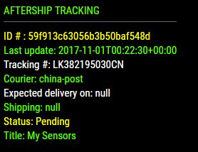
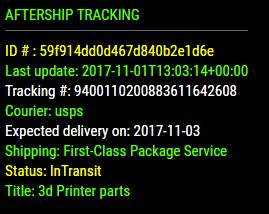
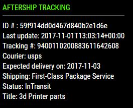

## MMM-AfterShip

Track all your deliveries in one module. Supports 428 couriers worldwide.

## Here's what you get

A rotation of all your deliveries that are currently in transit.
Status, estimated delivery date, which courier, tracking number, etc. . .
UPS, FedEx, USPS, etc.. Very handy during the holiday season when you have
multiple deliveries coming by multiple couriers.

## Examples

* Annotated .css file included for coloring any way you like.

  

## Installation

* `git clone https://github.com/mykle1/MMM-AfterShip` into the `~/MagicMirror/modules` directory.

* Get your FREE API Key from https://www.aftership.com/

* You MUST add couriers to your account at aftership.com. It's easy and FREE!

## Config.js entry and options

    {
		disabled: false,
		module: "MMM-AfterShip",
		position: "top_left",
		config: {
			apiKey: "Your API Key GOES HERE",  // Your free API Key from aftership.com
			useHeader: true,                   // False if you don't want a header      
            	header: "Aftership Tracking",      // Change in config file. useHeader must be true
            	maxWidth: "300px",
            	animationSpeed: 3000,              // fade speed
            	rotateInterval: 30 * 1000,         // seconds between shipments
		}
	},

## Is there a module that SpaceCowboysDude hasn't fixed for you, Mykle? :^)
